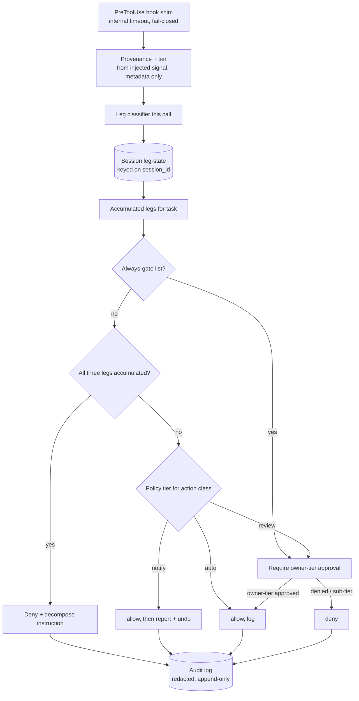

# feat: Trust & Capability Model for the buzai-exp Assistant

## Summary

Build the v1 trust layer for the buzai-exp self-host assistant as a drop-in for a Claude Code workspace: a PreToolUse-hook gate that assigns every tool call a trust tier from its turn's authenticated provenance, accumulates the three trifecta legs across a task, enforces the Rule of Two, consults a standing trust policy and an always-gate list, and writes a redacted audit entry. Greenfield — no implementation exists yet. The design rests on platform facts about Claude Code hooks that must be settled before the gate is built (see Resolve Before Building). The key-custody broker and the broader assistant runtime are out of scope.

## Problem Frame

The buzai PoC enforces trust ad-hoc through Claude Code's native prompts — fine for one careful operator, unsafe to hand to other self-hosters, and with no structural rule that content arriving over an untrusted channel must never drive a privileged action. The origin requirements make that the default by routing tool calls through one gate. This plan turns those requirements into buildable units — and surfaces where the Claude Code hook surface does not, by itself, deliver what the gate needs (provenance, subagent coverage, cross-call state, fail-closed timeouts), so those gaps are resolved first rather than discovered mid-build.

## Resolve Before Building

These were deferred as "implementation details" in the origin but are design-time decisions the gate cannot be built without. U1 exists to settle them; the rest of the plan assumes their resolution.

- **RB1. Trigger provenance into the hook.** The PreToolUse stdin payload carries `session_id`, `transcript_path`, `cwd`, `tool_name`, `tool_input`, `tool_use_id`, `permission_mode` — but nothing identifying the channel/source that triggered the turn. Without an injected provenance signal, `resolve_tier` has no input and every call collapses to fail-closed untrusted. Decide the mechanism: an orchestration wrapper that writes per-turn provenance to a known file/env var the hook reads, or scope v1 to a single owner channel (all direct CLI/Remote-Control turns are owner-tier, external-content provenance tracked separately). Reading the transcript body to infer origin is disallowed — it violates the metadata-only invariant.
- **RB2. Subagent hook coverage.** PreToolUse hooks are reported not to fire for tool calls made by subagents spawned via the Task/Agent tool (Claude Code issue #34692), and subagents may not inherit the permission allowlist (#22665). If true in the target runtime, a delegating assistant executes connector calls with zero gate coverage. Verify in U1; if confirmed absent, v1 must either prohibit subagent delegation or add a second enforcement boundary (MCP allowlist / per-connector wrapper) that survives delegation.
- **RB3. Owner-tier authentication.** R8 (policy edits) and the U8 emergency bypass both root in identifying the owner. Decide the concrete owner signal (e.g., a provenance file written only by the owner's session, or the single-owner-channel assumption from RB1) and whether it is a label or credential-bound. This is a KTD, not a deferral.

## Requirements

Traceability to origin R-IDs (`see origin`).

**Trust derivation**
- R1. Each tool call's trust tier comes from its turn's authenticated provenance; message content never raises the tier (origin R1).
- R2. Ship a default four-tier taxonomy — owner / configured-automation / known-contact / untrusted-external — configurable by channel mapping, not code (origin R2).
- R3. Unrecognized or unauthenticated sources default to untrusted-external (origin R3).

**Gate**
- R4. A PreToolUse-hook gate classifies each call against the three trifecta legs, accumulates legs across the task, and is the enforcement point for every connector whose calls reach the hook (managed and local; subagent coverage per RB2) (origin R4).
- R5. When a task has accumulated all three legs, the gate denies the offending call and returns a decompose-and-reapprove instruction; true separation of the privileged step depends on re-entry through the gate (origin R5).
- R6. Approval prompts state the action, the reason, and what could not be verified; an approval is trust-evaluated and a sub-owner-tier approval on an owner-gated action is treated as deny (origin R6).

**Standing policy**
- R7. A user-owned, versioned policy assigns each action class auto / notify / review; unmatched defaults to review (origin R7).
- R8. The policy file — and the always-gate config (R10) and known-recipients list (R10) — are edit-protected: only an owner-tier task, or one with no untrusted-content leg, may modify them (origin R8).
- R9. auto executes and logs; notify executes then reports with an undo affordance; review gates before acting (origin R9).

**Always-gate**
- R10. A configurable always-gate list forces approval regardless of tier or leg count, defaulting to money movement, sends to a new recipient, destructive deletes, new connector-scope grants, and edits to the policy / always-gate / known-recipients configs (origin R10).

**Audit log**
- R11. Every gate decision is appended to an audit log (provenance, tier, accumulated legs, outcome, approver/timestamp, config edits, notify/auto actions) (origin R13).
- R12. Audit entries redact PII and sensitive content by default — references and hashes, never the protected payload — against a v1 baseline ruleset (origin R14).
- R13. The audit log is human- and agent-readable, append-only with tamper-evidence, and not silently rewritable by an ordinary tool call (origin R15).

**Packaging**
- R14. Generalizable machinery is separable from personal configuration; safe behavior out of the box, customization via config (origin R11, R12).

## Key Technical Decisions

- KTD1. **PreToolUse-hook gate as the primary enforcement point.** Managed connectors keep keys in claude.ai, so a local key-custody broker can't own them; the hook is the choke point for calls that reach it. Its coverage limits (RB2) are explicit, not assumed.
- KTD2. **Python gate logic behind a thin hook command shim.** Testable as the rule set grows; mirrors the PoC's Python scripts. Pure shell would not scale to leg accumulation + policy.
- KTD3. **Config and state are files in the workspace, not a database.** Matches the knowledge-management decision (`see docs/decisions/knowledge-management.md`): git-diffable, viewable via the repo, no infra to run.
- KTD4. **Settle the substrate first.** U1 resolves RB1–RB3 against the live runtime before any gate logic is built on them.
- KTD5. **Fail-closed is engineered, not inherited.** Claude Code's default on hook timeout is to proceed (fail-open). The shim wraps the gate in a short internal timeout and maps any timeout, non-zero exit, or unhandled exception to an explicit `deny`. Unknown channel → untrusted; unmatched action class → review.
- KTD6. **Tier from provenance metadata only; the untrusted-content leg from content provenance.** The tier resolver never reads message content. The untrusted-content leg is raised whenever a task ingests any untrusted-tier source (external email body, web fetch, unknown-origin file) and is sticky for the rest of that task — it is not inferred from the triggering channel's tier, which would miss an owner-triggered task that pulls in poisoned content (the EchoLeak case).
- KTD7. **Audit redaction by reference, not payload.** Entries store type + reference + content-hash. References themselves are checked against the redaction baseline so a "recipient-by-domain" reference can't leak a confidential counterparty.
- KTD8. **Cross-call leg state is session-scoped.** The trifecta accumulates across separate tool calls, so the gate persists per-task leg state keyed on the hook's `session_id` and reads it on each call. Rule-of-Two is evaluated against accumulated legs, not the single call.

## High-Level Technical Design



## Output Structure

```text
trust/
  hook.py              # PreToolUse entry shim: internal timeout, fail-closed deny on error
  gate.py              # orchestrates provenance/tier -> classify -> accumulate -> always-gate -> policy
  provenance.py        # read injected per-turn provenance (RB1); resolve owner tier (RB3)
  tiers.py             # provenance -> trust tier (metadata only); fail-closed to untrusted
  classify.py          # tool call -> legs; untrusted-content sticky per task
  legstate.py          # session-scoped accumulated leg state (keyed on session_id)
  policy.py            # action class -> auto/notify/review; edit-protected
  always_gate.py       # always-gate predicate (imported by gate.py)
  audit.py             # append redacted, tamper-evident entries
  redact.py            # payload -> type + reference + content-hash (v1 baseline ruleset)
  config/
    tiers.yaml  connector-legs.yaml  always-gate.yaml  policy.yaml  known-recipients.yaml
  tests/
    smoke_substrate.md
    test_tiers.py test_classify.py test_legstate.py test_policy.py
    test_gate.py test_always_gate.py test_redact.py
audit/                 # append-only redacted log, write-protected from ordinary tool calls
.claude/settings.json  # registers trust/hook.py as the PreToolUse hook (install step)
```

Personal channel mappings live in gitignored local overrides (e.g. `trust/config/tiers.local.yaml`); the template ships only generalizable defaults.

## Implementation Units

### Phase A — Settle the substrate

#### U1. Substrate verification and provenance plumbing

- **Goal:** Resolve RB1–RB3 against the live runtime before any gate logic depends on them.
- **Requirements:** R1, R4 (preconditions); RB1, RB2, RB3.
- **Dependencies:** none.
- **Files:** `trust/tests/smoke_substrate.md` (procedure + recorded results), `trust/provenance.py` (provenance reader + owner-tier resolver), a throwaway logging PreToolUse hook in `.claude/settings.json`.
- **Approach:** With a no-op logging hook (matcher `mcp__.*` plus built-ins), record which call sources fire PreToolUse: each managed connector (Gmail/Calendar/Drive/Todoist), each local MCP server (Sheets/Xero), built-in Bash, and **a subagent/Task-spawned tool call** (RB2). Establish and test the provenance-injection mechanism chosen for RB1 (orchestration writes per-turn provenance to a known path; the hook reads it) and the owner-tier signal (RB3). If subagent calls bypass the hook, record the decision (prohibit delegation in v1, or add the MCP-allowlist boundary) before Phase B.
- **Patterns to follow:** Claude Code hook JSON contract (`hookSpecificOutput.permissionDecision`); okhlopkov entrypoint sentinel-logging.
- **Test scenarios:** Each managed connector, each local MCP, and Bash fire a sentinel write; a subagent-issued tool call is checked for firing and the result recorded; the provenance reader returns the injected signal for an owner turn and for a simulated external-content turn; missing provenance file → untrusted-external.
- **Verification:** A results table records hook coverage per source (including subagents) and the chosen RB1/RB3 mechanisms, or names the gap that blocks Phase B.

### Phase B — Core gate

#### U2. Trust-tier taxonomy and resolver

- **Goal:** Resolve a turn's provenance to a trust tier from metadata alone, with shipped defaults.
- **Requirements:** R1, R2, R3.
- **Dependencies:** U1.
- **Files:** `trust/tiers.py`, `trust/config/tiers.yaml`, `trust/tests/test_tiers.py`.
- **Approach:** `resolve_tier(provenance) -> Tier` over the U1 provenance signal — never message body. Four-tier default; unknown → untrusted-external; local override layered over default.
- **Patterns to follow:** config-as-YAML-in-workspace (KM decision); fail-closed default (KTD5).
- **Test scenarios:** owner provenance → owner; automation id → configured-automation; known sender → known-contact; unknown → untrusted-external; a tier-claiming string in message content does NOT change the tier; missing provenance → untrusted-external.
- **Verification:** Resolver returns the documented tier per fixture and never reads a content field.

#### U3. Trifecta leg classifier

- **Goal:** Classify a single tool call into the legs it touches; mark the untrusted-content leg by content provenance.
- **Requirements:** R4 (classification half), KTD6.
- **Dependencies:** U1, U2.
- **Files:** `trust/classify.py`, `trust/config/connector-legs.yaml`, `trust/tests/test_classify.py`.
- **Approach:** `classify(tool_name, tool_input, provenance) -> set[Leg]` via a connector→legs map bounded to the connectors confirmed reachable in U1 (do not enumerate not-yet-migrated connectors). The untrusted-content leg is raised when the call reads from an untrusted-tier source; U4 makes it sticky for the task. Unknown/unmapped tool → conservative all-legs.
- **Patterns to follow:** MCP tool naming `mcp__<server>__<tool>` (verified this session); fail-conservative on unknown.
- **Test scenarios:** `mcp__gmail__send` → {external_send}; reading a hub → {private_read}; reading an external email body → {private_read, untrusted_content}; unknown tool → all-legs; read-only calendar fetch → {private_read}.
- **Verification:** Documented leg sets per fixture; unmapped tools fail conservative.

#### U9. Session-scoped leg-state accumulator

- **Goal:** Persist and read accumulated trifecta legs per task so Rule-of-Two sees cross-call state.
- **Requirements:** R4 (accumulation), KTD8.
- **Dependencies:** U1, U3.
- **Files:** `trust/legstate.py`, `trust/tests/test_legstate.py`.
- **Approach:** Keyed on the hook's `session_id`. On each call, union this call's legs (U3) into the task's accumulated set, persist, and return the accumulation; the untrusted-content leg, once set, stays set for the session (sticky, KTD6). Local file under `audit/`-adjacent state, write-protected like the audit log.
- **Test scenarios:** read then ingest-untrusted then send across three calls → accumulated {private_read, untrusted_content, external_send}; untrusted-content stays set after the ingesting call; a new session_id starts empty; concurrent sessions don't cross-contaminate.
- **Verification:** Accumulated set matches the call sequence; stickiness holds; session isolation holds.

#### U4. Rule-of-Two gate (PreToolUse hook)

- **Goal:** Tie provenance/tier + classifier + leg-state + always-gate + policy into the hook decision: allow / ask / deny, deny-with-decompose on all-three, fail-closed.
- **Requirements:** R4, R5, R6.
- **Dependencies:** U2, U3, U5, U6, U7, U9.
- **Files:** `trust/hook.py`, `trust/gate.py`, `trust/tests/test_gate.py`, `.claude/settings.json` (real PreToolUse registration; remove the U1 throwaway hook entry).
- **Approach:** `gate(event) -> decision`. Resolve tier, classify legs, accumulate (U9); if accumulated legs == all three, deny with a decompose-and-reapprove reason (R5 is a soft control — the hook cannot itself spawn the privileged step); else consult always-gate (U6) then policy (U5). Emit `permissionDecision` allow/ask/deny with a reason naming action + why + unverified facts (R6); an approval is itself tier-evaluated. Every path calls audit (U7). The shim wraps gate() in a short internal timeout and maps timeout/exception/non-zero to `deny` (KTD5) — it does not rely on the harness default.
- **Execution note:** Implement the decision matrix and the fail-closed wrapper test-first.
- **Patterns to follow:** `hookSpecificOutput.permissionDecision` contract; deny→ask→allow precedence.
- **Test scenarios:** Covers AE1 (origin). Accumulated all-three → deny + decompose reason; two-leg not always-gate, policy auto → allow; two-leg policy review → ask with a reason; a hung gate → deny (fail-closed wrapper); a sub-owner-tier approval on an owner-gated action → deny; deny-rule-matched → stays denied.
- **Verification:** Decision-matrix fixtures return the documented decision; the kill/hang test yields deny; reasons non-empty on ask/deny.

### Phase C — Policy, safety surfaces, audit

#### U5. Standing trust policy

- **Goal:** Resolve an action class to auto/notify/review, default review, with edit-protection and the notify undo affordance.
- **Requirements:** R7, R8, R9.
- **Dependencies:** U2.
- **Files:** `trust/policy.py`, `trust/config/policy.yaml`, `trust/tests/test_policy.py`.
- **Approach:** `tier_for(action_class)`, unmatched → review. Edits to the policy (and, shared with U6, the always-gate and known-recipients configs) are allowed only from an owner-tier task or one with no untrusted-content leg. notify returns an "executed, undo available" signal the runtime surfaces.
- **Test scenarios:** Covers AE3, AE4 (origin). Unmatched class → review; configured auto class → auto; edit from owner tier → allowed; edit from a task carrying the untrusted-content leg → refused regardless of contents; notify → execute+undo, not a pre-prompt.
- **Verification:** Documented tiers; edit-authority fixtures enforce R8 across all three protected configs.

#### U6. Always-gate list and known-recipients

- **Goal:** Force approval for high-blast-radius classes regardless of tier/legs, with shipped defaults and a write-protected known-recipients list.
- **Requirements:** R10, R8 (config protection).
- **Dependencies:** U3.
- **Files:** `trust/always_gate.py`, `trust/config/always-gate.yaml`, `trust/config/known-recipients.yaml`, `trust/tests/test_always_gate.py`.
- **Approach:** A predicate (imported by U4's gate.py, not edited into it) consulted before policy. Ships defaulting to money movement, new-recipient sends, destructive deletes, new connector-scope grants, and config edits. "New recipient" = a recipient absent from `known-recipients.yaml`; that file is edit-protected like the policy (U5) so a tool call can't pre-seed it to dodge the gate.
- **Test scenarios:** Covers AE2 (origin). Send to a recipient not in known-recipients → approval even at two legs and policy auto; money movement → always approval; listed action at owner tier → still gated; a write to known-recipients from an untrusted-content task → refused; routine non-listed two-leg action → falls through to policy.
- **Verification:** Listed classes always ask/deny; unlisted fall through; known-recipients edits honor R8.

#### U7. Redacted, tamper-evident audit log

- **Goal:** Append a redacted entry per gate decision against a v1 baseline ruleset, stored so an ordinary tool call cannot silently rewrite it.
- **Requirements:** R11, R12, R13.
- **Dependencies:** U2, U3.
- **Files:** `trust/audit.py`, `trust/redact.py`, `trust/tests/test_redact.py`, `audit/`.
- **Approach:** `record(decision, context)` appends provenance, tier, accumulated legs, outcome, approver+timestamp, and (for edits/notify/auto) the action — after `redact()` reduces sensitive fields to type + reference + content-hash. v1 redaction baseline: credential-shaped strings (keys/tokens/passwords), email addresses and personal names, secret-bearing argument fields (auth headers, env values), and sensitive path substrings; references are themselves baseline-checked. Append-only with each entry chained to a hash of the prior (tamper-evident); the log lives where only the gate process writes it, not arbitrary tool calls.
- **Patterns to follow:** KTD7 redaction-by-reference; KM markdown/JSONL substrate.
- **Test scenarios:** Covers AE5 (origin). A split decision logs type/tier/legs/outcome with file-by-name+hash and recipient-by-domain, not contents; an entry never contains a raw payload; an unknown sensitive field fails closed (redacts); a tampered prior entry breaks the hash chain on read; an auto action is logged.
- **Verification:** No raw sensitive payload; one entry per decision; hash chain validates and detects tampering.

### Phase D — Template

#### U8. Template packaging, safe defaults, install and recovery docs

- **Goal:** Ship the machinery with safe defaults separable from personal config, plus install and emergency-recovery docs.
- **Requirements:** R14; R3/R7 safe-by-default.
- **Dependencies:** U2, U4, U5, U6, U7, U9.
- **Files:** `trust/config/*.yaml` (shipped defaults), `.gitignore` (ignore `*.local.yaml`, `audit/`, leg-state), `trust/README.md`.
- **Approach:** Confirm every config ships a safe default (unknown channel untrusted, all action classes review). Document the channel-mapping override as a local file; document registering `trust/hook.py` as the PreToolUse hook and **merging** rather than overwriting an adopter's existing `.claude/settings.json`. Document the emergency bypass as a time-/count-limited exemption that still audits each use and whose re-enable path does not require owner auth (so a bad auth bootstrap can't trap the owner). No personal data in shipped defaults.
- **Test scenarios:** Test expectation: none — packaging and docs; behavioral safety is covered by U2/U5 defaults tests.
- **Verification:** A fresh clone with no local config gates everything to review and treats all channels as untrusted; README install steps register the hook without clobbering existing settings; the bypass is documented as bounded and auditable.

## Scope Boundaries

### Deferred to Follow-Up Work
- Local key-custody broker and migrating managed connectors to local MCP (origin Deferred).
- Earned-trust auto-promotion / tenure (origin Deferred).
- Multi-tenant / multi-principal isolation (origin Deferred).
- The broader assistant runtime — connectors, scheduling, knowledge base — and the decoupled compound learning step (`see docs/brainstorms/2026-06-23-compound-learning-step-requirements.md`).

## System-Wide Impact

The gate runs on every covered tool call, so it is cross-cutting: a gate bug or slowdown affects all assistant actions. Mitigations — engineered fail-closed (KTD5), a bounded/audited owner bypass with an auth-free re-enable (U8), and keeping the hot path local-only with cached/mtime-checked config reads to control per-call latency.

## Risks & Dependencies

- **Subagent hook coverage (gating, RB2).** If PreToolUse does not fire for subagent tool calls (issue #34692), a delegating assistant bypasses the gate. U1 verifies; an unmitigated gap forces prohibiting delegation or adding the MCP-allowlist boundary in v1.
- **Provenance availability (gating, RB1).** No channel metadata in the hook payload; without the injected provenance signal the gate degrades to "review everything." U1 establishes the mechanism.
- **Fail-open default.** Claude Code proceeds on hook timeout; fail-closed must be engineered in the shim (KTD5) and tested by hanging the gate.
- **Owner-tier authentication (RB3).** Root of trust for policy edits and the bypass; settled in U1, not deferred.
- **Cross-call state correctness.** Rule-of-Two depends on session-keyed leg accumulation (U9); a wrong or resettable session key would let a task split its legs across calls to evade the check.
- **Gate latency.** Per-call hook on a long-lived agent; keep the hot path local and cache config.
- **Audit/known-recipients integrity.** Both must resist rewrite by an ordinary tool call (U7 hash chain, R8 edit-protection); otherwise an attacker covers tracks or pre-seeds recipients.

## Open Questions

**Deferred to implementation**
- The exact redaction baseline field list beyond the v1 categories in U7.
- Action-class taxonomy granularity in the policy file.
- The decision-card content shape within Remote Control's native approval prompt.

(Provenance mechanism, subagent coverage, and owner-tier authentication are no longer deferred — see Resolve Before Building / U1.)

## Sources / Research

- `docs/brainstorms/2026-06-23-trust-capability-model-requirements.md` — origin requirements.
- `docs/decisions/knowledge-management.md` — config-as-markdown-in-git substrate.
- Claude Code hook contract (verified this session): PreToolUse fires on managed connectors under `mcp__<server>__<tool>`; `hookSpecificOutput.permissionDecision` allow/deny/ask with deny→ask→allow precedence; stdin carries `session_id`/`transcript_path`/`tool_name`/`tool_input` but no trigger-channel metadata; default on timeout is to proceed (fail-open).
- Claude Code issues #34692 (PreToolUse does not fire for subagent/Task tool calls) and #22665 (subagents may not inherit the permission allowlist) — basis for RB2.
- the earlier private PoC — Python workspace scripts and the connector split motivating KTD1.
- External: Simon Willison "lethal trifecta"; Meta "Agents Rule of Two"; OWASP Agentic Top-10 2026; EchoLeak CVE-2025-32711 (the trusted-trigger / untrusted-content case behind KTD6).
