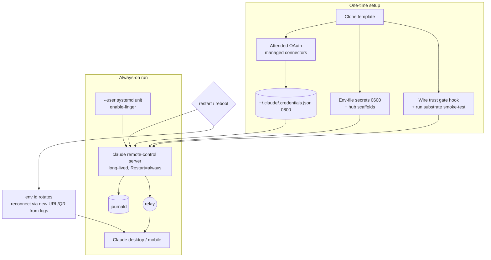

# feat: Adopter Onboarding & Operability for buzai-exp

## Summary

Stand up one always-on Claude Code "chief of staff" from the buzai-exp template and verify it end to end. Ship a `--user` systemd run model (long-lived `claude remote-control` server, not the exit-on-complete pattern that caused silent prompt loss), secrets scaffolding, a connector + hub + trust-gate setup runbook, a few small operability helper scripts, and an executable 8-point smoke test. Near-term target is the author's own instance; broad-adopter ergonomics are secondary. The MVP validates survives-restart, not indefinite always-on.

## Problem Frame

The trust gate is merged but nothing lets a person actually run the assistant and exercise it. The operational knowledge lives in the author's earlier private PoC and a postmortem, not in a followable form, and the PoC's own unit carries a silent-prompt-loss footgun. This plan turns the onboarding requirements (`see origin: docs/brainstorms/2026-06-23-adopter-onboarding-requirements.md`) into the run scaffolding, runbook, and smoke test needed to stand up and verify one instance.

## Resolved Gates (from research)

Both origin "Resolve before planning" gates are settled (Claude Code docs + claude-code-guide research, recorded in Sources):

- **Run mode:** there is no never-exits session mode. The fix is to run the **long-lived `claude remote-control` server process** under systemd (sessions attach on demand), not `--spawn session` exit-on-complete. Claude Code offers no prompt-buffering/input-gating, so the crash-restart reconnect window is a documented residual, not solved in MVP.
- **Headless OAuth:** no documented headless flow; the supported path is a **one-time attended OAuth** (on a workstation, or via an SSH-forwarded localhost callback), after which credentials persist in `~/.claude/.credentials.json` (mode 0600) and survive restarts. The **~8h idle access-token expiry** (issue #31095) is the unattended-uptime ceiling — manual bounce in MVP.

## Requirements

Traceability to origin R-IDs / SC-IDs (`see origin`).

**Run & supervise**
- R1. A `--user` systemd unit template runs the long-lived remote-control server, restarts on crash, starts on boot (with `enable-linger`), and logs to journald (origin R1).
- R2. The unit runs the persistent server, not exit-on-complete; the residual crash-restart reconnect window is documented, and prompt-buffering is out of scope (origin R2; deferred).

**Setup, connectors, hubs**
- R3. A setup runbook covers clone → prerequisites → connectors → hubs → trust-gate wiring → start (origin R4).
- R4. The runbook documents one-time attended OAuth for managed connectors and env-file secrets for local MCP, and that credentials then persist headless (origin R5, R10).
- R5. Hubs are seeded from shipped empty/example scaffolds; populated hubs are personal, gitignored (origin R7, R11).
- R6. The runbook includes wiring the trust gate per `trust/README.md` (register the PreToolUse hook by merge, supply provenance, configure the owner channel) and running `trust/tests/smoke_substrate.md` (origin R6).

**Remote control & operability**
- R7. The runbook explains attaching from desktop and mobile, reconnecting after a restart to the new environment, and retrieving the current environment URL/QR from the service logs (origin R8).
- R8. A documented liveness check uses the established relay socket plus a no-op round-trip (not the log banner), and a manual self-diagnosis checklist with known red herrings (origin R9).

**Auth durability**
- R9. A restart within the relay-token validity window, on a clock-synced host, needs no re-auth; the ~8h idle-token ceiling and relay-token lapse are documented with a manual bounce (origin R10; the watchdog is deferred).

**Security & exposure**
- R10. The setup documents the always-on session's trust boundary (bound to the owner's Claude.ai account; the environment URL/QR is owner-equivalent access, treated as a secret) with an explicit threat note (origin R12).
- R11. Secrets are protected: env-files and the credentials file at 0600 and outside the workspace; shipped example files use placeholder values (variable names are fine, no real secret values); no secret values in journald; the smoke test asserts the secrets dir and credentials file are untracked/0600 before first start (origin R13).

**Packaging**
- R12. Generalizable machinery ships separate from personal state; the template carries machinery + empty scaffolds only (origin R11).
- R13. The manual foreground CLI invocation is documented as the simple path for quick, local, or non-Linux runs (origin R3).

## Key Technical Decisions

- KTD1. **Long-lived remote-control server under `--user` systemd, not `--spawn session` exit-on-complete.** The persistent server keeps the process up and attaches sessions on demand, avoiding the PoC's per-completion respawn that swallowed prompts. `Restart=always`, journald, `network-online.target`, `EnvironmentFile` drop-ins, and `enable-linger` mirror the PoC's `claude-remote.service`.
- KTD2. **One-time attended OAuth, then headless persistence.** Managed-connector OAuth is performed once on a workstation (or via an SSH-forwarded localhost callback); credentials persist in `~/.claude/.credentials.json` (0600) across restarts. Documented, not automated (no headless flow exists).
- KTD3. **MVP claim is survives-restart, not indefinite always-on.** The ~8h idle access-token expiry (issue #31095) and relay-token lapse are documented limits with a manual bounce; the token-expiry watchdog and the rest of the self-healing track are deferred.
- KTD4. **Liveness = an established relay socket scoped to the relay peer (matched to the server PID's connections against a known relay host, not bare `:443`) + a recent last-good-turn timestamp parsed from journald**, never the "Ready" banner (unreliable). A synchronous no-op round-trip is not feasible headlessly (no status command; attach is via the apps), so a parsed last-good-turn is the round-trip stand-in.
- KTD5. **Environment URL/QR is retrieved by parsing the service's journald logs** — Claude Code exposes no status command for it — and the relay environment id rotates on restart, so clients reconnect to the new environment.
- KTD6. **Secrets scaffolding ships hard-failing placeholders, never real values.** Env-file drop-ins and the credentials file are 0600 and live **outside the workspace/repo** (e.g. `~/.config/buzai/secrets/`, beyond any file-write tool's reach) so an untrusted task can't overwrite them. The unit uses `EnvironmentFile=<path>` **without** the `-` prefix, so a missing secrets file hard-fails the start (the `-` form fails open — the footgun to avoid). The smoke test asserts the secrets dir and credentials file are 0600 and untracked; connector output must not log secret values.
- KTD7. **Helpers are stdlib Python (mirroring `trust/`); the unit and thin glue are shell.** Logic that deserves tests (log parsing for the env URL, the liveness probe, the secrets-perms preflight) is Python with `unittest`; the systemd unit and wrapper stay declarative shell.
- KTD8. **Personal vs generalizable separation.** The template ships machinery + empty scaffolds; populated hubs, secrets, and local config are gitignored (`see docs/decisions/knowledge-management.md`).

## High-Level Technical Design



## Output Structure

```text
deploy/
  claude-remote.service.template   # --user unit: long-lived server, Restart=always, journald
  README.md                        # systemd install + enable-linger + secrets wiring
  env/
    email.env.example              # placeholder paths/keys that hard-fail until set
    xero.env.example
scripts/
  env_url.py            # extract current environment URL/QR from journald
  liveness.py           # relay-socket (scoped peer) + no-op round-trip probe
  secrets_preflight.py  # assert secrets dir gitignored/untracked + 0600 perms
  smoke_test.py         # drive/track the 8-point smoke test (SC1-SC8)
  tests/
    test_env_url.py  test_liveness.py  test_secrets_preflight.py  test_smoke_test.py
hubs/
  README.md  _example-hub.md        # empty/example scaffolds; real hubs gitignored
docs/
  SETUP.md             # the getting-started runbook (clone -> start -> connect -> use)
  SMOKE-TEST.md        # the 8-point checklist
```

`.gitignore` adds `deploy/env/*.env` with `!*.env.example` negations, `hubs/*.md` with `!hubs/README.md` and `!hubs/_example-hub.md` negations, and local config; the real secrets and the credentials file live outside the repo. The trust gate (`trust/`) already exists and is wired, not rebuilt.

## Implementation Units

### Phase A — Run machinery

#### U1. `--user` systemd unit template and run model

- **Goal:** A drop-in systemd unit that runs the long-lived remote-control server, survives crash and reboot, and logs to journald.
- **Requirements:** R1, R2.
- **Dependencies:** none.
- **Files:** `deploy/claude-remote.service.template`, `deploy/README.md`.
- **Approach:** Mirror the PoC unit (`Type=simple`, `Restart=always`, `RestartSec`, `network-online.target`, `Environment=PATH`, `StandardOutput/Error=journal`) but set `ExecStart` to the long-lived server (no `--spawn session` exit-on-complete). Document `systemctl --user enable --now` and `loginctl enable-linger` (and the privilege it needs + a fallback when unavailable). Reference the secrets drop-ins from U2 with `EnvironmentFile=<path>` (no `-` prefix, so a missing file hard-fails the unit), and add an `ExecStartPre` that runs `secrets_preflight.py` so the service refuses to start on a miswired secrets layout.
- **Patterns to follow:** the PoC's `~/.config/systemd/user/claude-remote.service` and its `EnvironmentFile` drop-ins (Sources).
- **Test scenarios:** Test expectation: none — declarative unit template + docs; behavioral verification is the smoke test (SC1).
- **Verification:** Installing the template, enabling the unit, and rebooting yields a running server whose liveness check passes (deferred to U7's smoke test); the unit fails to start when the secrets env-file is absent (no `-` prefix).

#### U2. Secrets scaffolding & hardening

- **Goal:** Ship a safe secrets layout that can't leak and fails closed until configured.
- **Requirements:** R11; supports R4.
- **Dependencies:** none.
- **Files:** `deploy/env/email.env.example`, `deploy/env/xero.env.example`, `.gitignore`.
- **Approach:** Example env-files use placeholder values (variable names are fine; no real secret values) and a comment that the real files live outside the workspace at 0600, beyond file-write-tool reach; the unit's `EnvironmentFile=<path>` (no `-` prefix) hard-fails the service until the adopter creates the real file. `.gitignore` covers `deploy/env/*.env` with `!*.env.example` negations. The credentials file lives outside the repo at `~/.claude/.credentials.json`, protected by OS perms (0600), not `.gitignore` — `secrets_preflight.py` verifies it. Document the journald no-secrets expectation.
- **Patterns to follow:** the PoC's `.secrets/*.env` + systemd `EnvironmentFile` drop-in pattern.
- **Test scenarios:** Test expectation: none — example files + gitignore; the untracked/perms assertion is exercised by `secrets_preflight.py` (U3).
- **Verification:** A fresh clone has no real secrets tracked; the service refuses to start until the env-file exists.

#### U3. Operability helper scripts

- **Goal:** Small, tested Python utilities the runbook and smoke test call.
- **Requirements:** R7, R8, R11.
- **Dependencies:** none (stdlib only).
- **Files:** `scripts/env_url.py`, `scripts/liveness.py`, `scripts/secrets_preflight.py`, `scripts/tests/test_env_url.py`, `scripts/tests/test_liveness.py`, `scripts/tests/test_secrets_preflight.py`.
- **Approach:** `env_url.py` parses journald output (fed a log sample) and returns the current environment URL/QR target; it treats that output as owner-equivalent secret (TTY-only by default, no piping to logs). `liveness.py` reports ready/not-ready from two parsed inputs: an established relay socket owned by the server PID and matched to a known relay host (an `ss`-style sample; a bare `:443` to another host is not-ready), plus a recent last-good-turn timestamp parsed from a journald sample (the headless round-trip stand-in). The relay host is a config constant carried from the PoC's observed endpoint. `secrets_preflight.py` asserts the secrets dir **and** `~/.claude/.credentials.json` are 0600, and that the secrets dir is gitignored and untracked. Pure functions take input strings/paths so they unit-test without a live system.
- **Execution note:** Implement the parsers test-first against captured sample inputs.
- **Patterns to follow:** `trust/` stdlib-Python + `unittest` conventions; feed fixtures rather than shelling out in tests.
- **Test scenarios:**
  - `env_url`: a journald sample with an environment URL → extracts it; a sample with none → returns empty/None; multiple restarts in the log → returns the most recent.
  - `liveness`: `ss` sample with an ESTAB socket (server PID → known relay host) plus a recent last-good-turn line → ready; a bare `:443` to another host → not-ready (no false-green); socket present but stale/absent last-good-turn → not-ready; no matching socket → not-ready.
  - `secrets_preflight`: a tracked secrets file → fails; gitignored + untracked + 0600 → passes; a 0644 secret file → fails on perms; a `~/.claude/.credentials.json` at 0644 → fails on perms.
- **Verification:** `python3 -m unittest scripts.tests...` is green; each helper exits with an unambiguous status (no overloaded success/timeout code).

### Phase B — Runbook & content

#### U4. Connector setup runbook

- **Goal:** A followable procedure to authenticate both connector classes and understand auth durability.
- **Requirements:** R4, R9, R10.
- **Dependencies:** U2.
- **Files:** `docs/SETUP.md` (connectors section).
- **Approach:** Document the one-time attended OAuth for managed connectors (workstation login, or SSH-forwarded localhost callback) and copying/locating `~/.claude/.credentials.json`; the local-MCP env-file step; that credentials persist across restart within token validity; and the ~8h idle-token / relay-token-lapse ceiling with the manual bounce recovery. If credentials are created on a workstation and moved to the server, verify the SSH host key, prefer piping over scp, and `chmod 0600` + verify perms on the target before starting the service. Note the owner-account trust boundary and that the environment URL is owner-equivalent access (R10).
- **Patterns to follow:** PoC `planning/operations.md` "Auth / tokens" section; the research verdicts in Sources.
- **Test scenarios:** Test expectation: none — runbook prose; connector reachability is proved by smoke-test SC3/SC4.
- **Verification:** Following the section, an adopter authenticates one managed and one local connector and both work through the gate (SC3, SC4).

#### U5. Hub scaffolds, trust-gate wiring, and self-diagnosis runbook

- **Goal:** Seed hubs as empty scaffolds, wire the trust gate, and give the adopter a manual triage path.
- **Requirements:** R5, R6, R8, R12.
- **Dependencies:** U3.
- **Files:** `hubs/README.md`, `hubs/_example-hub.md`, `.gitignore` (hubs), `docs/SETUP.md` (gate-wiring + self-diagnosis sections).
- **Approach:** Ship example/empty hub scaffolds with real hubs gitignored. Document wiring the gate per `trust/README.md` (merge the PreToolUse hook into `.claude/settings.json`, supply provenance, configure the owner channel) and running `trust/tests/smoke_substrate.md`. Include the manual self-diagnosis checklist (unit active, relay socket, token expiries, model resolves, MCP connected, restart-loop, host clock/disk/mem) and the known red herrings — carried from the PoC operations doctrine, distinct from the deferred `assistant doctor` automation. Include the trust gate's deploy step of setting `audit/` to 0700 owned by the service user so no ordinary tool call can rewrite the audit log.
- **Patterns to follow:** `trust/README.md` install steps; PoC `planning/operations.md` self-diagnosis runbook + known-red-herrings.
- **Test scenarios:** Test expectation: none — scaffolds + runbook; gate enforcement is proved by smoke-test SC5/SC7.
- **Verification:** A fresh clone ships no personal hub content; following the gate-wiring section produces a registered hook and a recorded substrate smoke-test.

#### U6. Getting-started README

- **Goal:** The top-level narrative that ties clone → configure → start → attach → use together with the right framing.
- **Requirements:** R3, R13; frames R10, KTD3.
- **Dependencies:** U1, U2, U4, U5.
- **Files:** `docs/SETUP.md` (overview/top), repo `README.md` (link + one-paragraph orientation).
- **Approach:** Lead with the end-to-end flow and the N=1-first framing (your own instance is the near-term target). State the survives-restart-not-indefinite scope and the two documented residual limits. Include the security/threat note (the environment URL is owner-equivalent access — display interactively, never pipe to logs/chat/monitoring) and the reconnect-after-restart step (retrieve the new URL via `env_url.py` / logs). Document the manual foreground CLI invocation as the simple quick/local/non-Linux path (origin R3).
- **Patterns to follow:** existing repo `README.md` voice.
- **Test scenarios:** Test expectation: none — documentation.
- **Verification:** A new reader can follow `docs/SETUP.md` start to finish without external context and reach an attached session.

### Phase C — Verification

#### U7. 8-point smoke-test checklist and driver

- **Goal:** Turn "stood up and working" into an executable, recorded 8-point check.
- **Requirements:** SC1–SC8 (origin); exercises R1–R12 (R12 packaging is a structural check at clone time).
- **Dependencies:** U1, U2, U3, U4, U5, U6.
- **Files:** `docs/SMOKE-TEST.md`, `scripts/smoke_test.py`, `scripts/tests/test_smoke_test.py`.
- **Approach:** A checklist doc plus a driver that runs the mechanizable checks and records pass/fail: a preflight gate (SC0) via `secrets_preflight.py` (secrets dir + credentials file 0600/untracked) that must pass before SC1 — also wired as the unit's `ExecStartPre`; service up + reboot-survival via `liveness.py` (relay socket + recent last-good-turn, SC1); desktop+mobile attach and reconnect-after-restart (SC2, manual with a logged prompt); a managed action (SC3) and a local-MCP action (SC4) through the gate; gate enforcement — a permitted owner action, a review/new-recipient prompt, an all-three-legs denial, and a second-action still gating (SC5); a journald scan after SC3/SC4 asserting no secret values were logged (R11); hub read/write persisting across restart (SC6); the substrate smoke-test recorded plus an `audit/` perms check (SC7, R6); auth-survives-restart within token validity (SC8). Steps that need a human (app attach, the round-trip confirmation) are checklist items; the rest the driver executes.
- **Execution note:** Build the driver's check-runner test-first against fixture inputs (the live checks are manual).
- **Patterns to follow:** `trust/tests/smoke_substrate.md` results-table shape; `scripts/` helpers from U3.
- **Test scenarios:**
  - Covers SC1. Given a liveness sample showing the relay socket + a recent last-good-turn, the driver marks SC1 pass; socket present but stale/absent last-good-turn → not-pass.
  - Covers SC0/R11. A tracked secrets file or a 0644 credentials file makes the preflight gate fail and blocks SC1.
  - Covers SC5. Given gate-decision fixtures (allow, ask, deny, second-action ask), the driver records all four sub-checks; a missing deny → SC5 incomplete.
  - Covers R11. A tracked secrets file makes the driver fail the secrets check.
  - The driver emits a single unambiguous overall status and a per-criterion table.
- **Verification:** Running the driver against fixtures produces the documented per-criterion verdicts; run live in the real runtime, all 8 criteria can be marked with evidence.

## Scope Boundaries

### Deferred to Follow-Up Work
- Prompt-buffering / input-gating to close the crash-restart silent-loss window (Claude Code offers none; would be custom).
- The self-healing / observability track — token-expiry watchdog, orphaned-task reaper, model-availability fallback, an `assistant doctor` automation, health introspection (origin Deferred; PoC R2/R5–R9). MVP ships the manual self-diagnosis checklist instead.
- Docker / container packaging; a hosted or multi-tenant offering; a GUI installer; auto-provisioning connector OAuth.
- The compound learning step (separate sibling brainstorm).

## System-Wide Impact

This layer wraps the whole assistant: the systemd unit is the process all connectors and the trust gate run inside, and the secrets/credentials handling is the blast-radius surface. A misconfigured unit or secrets path takes the whole assistant down or leaks credentials — mitigated by fail-closed secrets (U2/KTD6), the documented owner-only trust boundary (R10), and the smoke test as the go-live gate.

## Risks & Dependencies

- **Crash-restart silent-loss window (residual).** On any process restart the env id rotates and a prompt sent to the old window is lost until reconnect. Mitigation: reconnect-after-restart docs (R7) + liveness check; full buffering deferred.
- **~8h idle-token expiry (issue #31095).** Unattended uptime beyond the idle window can require a manual `/login`/bounce — the concrete "not indefinite always-on" limit. Mitigation: documented manual bounce; watchdog deferred.
- **Env-URL retrieval depends on log format.** `env_url.py` parses journald output; a Claude Code log-format change could break it. Mitigation: fixture-based tests + a documented manual fallback (read the URL from the logs directly).
- **Headless OAuth has no official flow.** The attended one-time step is a workaround; confirm the SSH-forwarded callback works on the target during the smoke test.
- **Token-refresh race with multiple instances (issue #24317).** Avoided by running a single instance (single principal).
- **`enable-linger` needs privileges.** Documented prerequisite with a fallback.

## Open Questions

**Deferred to implementation / smoke test**
- The exact journald log line that carries the environment URL on the adopter's Claude Code version (capture a real sample to finalize `env_url.py`).
- Whether the SSH-forwarded localhost-callback OAuth flow completes for managed connectors on the target host, or a workstation-then-copy-credentials step is required.
- Reconfirm env-id rotation and relay-socket liveness on the adopter's Claude Code version.

## Sources / Research

- `docs/brainstorms/2026-06-23-adopter-onboarding-requirements.md` — origin requirements.
- claude-code-guide research (this session): `claude remote-control` modes (server vs `--spawn session`; no never-exit mode); no documented headless managed-connector OAuth (one-time attended → headless persistence); credentials at `~/.claude/.credentials.json` mode 0600 persist across restart; issue #31095 (~8h idle access-token expiry, refresh not auto-used); issue #24317 (multi-instance token-refresh race); no status command for the environment URL (parse logs).
- The author's earlier private PoC (pre-buzai): the live `--user` `claude-remote.service` + `EnvironmentFile` drop-ins, `planning/operations.md` (run model, liveness, auth/token, self-diagnosis runbook, red herrings), and `planning/postmortems/2026-06-16-remote-control-stuck-connecting.md`.
- `trust/README.md` and `trust/tests/smoke_substrate.md` — the gate install + substrate-verification steps the runbook incorporates.
- `docs/decisions/knowledge-management.md` — the personal/generalizable separation the packaging requirement preserves.
