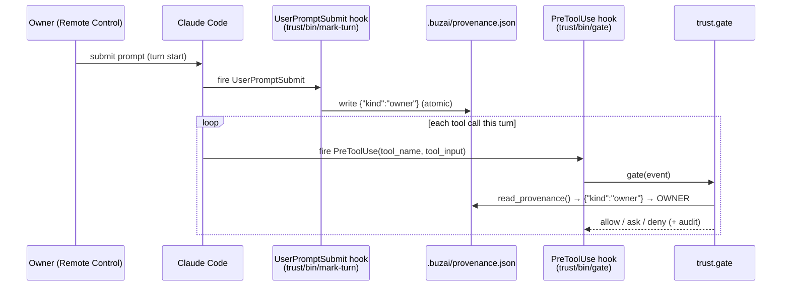
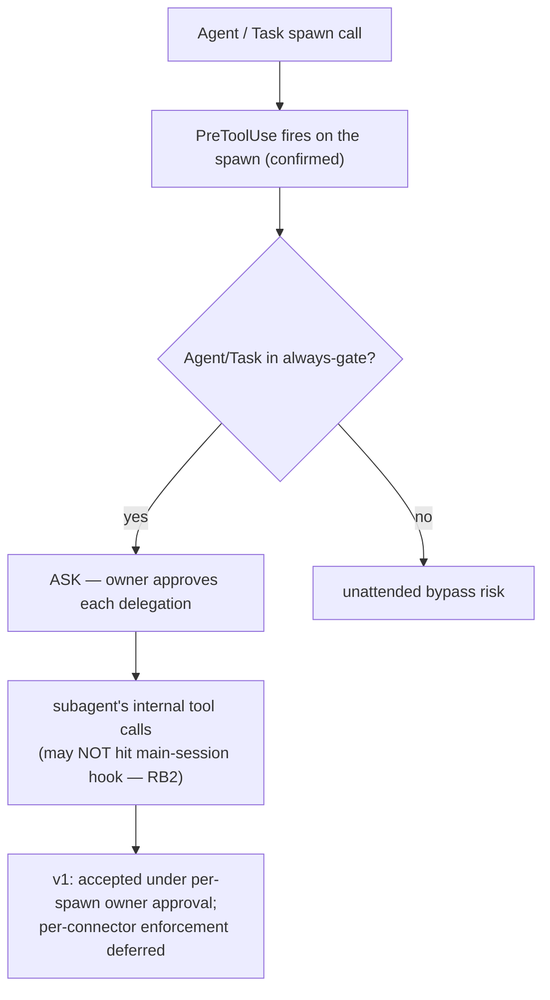

# feat: Trust-gate provenance writer & subagent containment

## Summary

The trust gate (merged) reads a per-turn provenance file to resolve a turn's trust
tier, but **nothing writes that file** in production — only the unit tests do. So in
the live runtime every turn resolves to `untrusted-external`, the channel-trust
taxonomy (R1–R3) is unrealized, and owner authority over protected-config edits
(R8/F4/AE3) is unreachable. Separately, PreToolUse hooks may not fire on a subagent's
*internal* tool calls, which would let the assistant delegate a privileged action to a
subagent to bypass the gate entirely (the `smoke_substrate.md` RB2 hole).

This plan closes both: a **per-turn `UserPromptSubmit` provenance writer** that marks
the single principal's turns as `owner`, and **subagent containment** that always-gates
the `Agent`/`Task` spawn so delegation can't slip past the gate unattended. It then
resolves the `smoke_substrate.md` RB1/RB2/RB3 decision gate and updates the adopter
docs. This was surfaced live during the MVP smoke test.

---

## Problem Frame

`trust/provenance.py` reads `$BUZAI_PROVENANCE_FILE` (else `<workspace>/.buzai/provenance.json`);
a missing/empty file yields `{}` → `UNTRUSTED_EXTERNAL` (fail-closed). That fail-closed
default is correct, but **no component writes the file**, so the fail-closed branch is
the *only* branch ever taken. Consequences, traced to the origin requirements:

- **R1–R3 unrealized.** "Every inbound trigger is assigned a trust tier from its
  authenticated channel" — but no turn is ever assigned anything but the fail-safe tier,
  because the channel/kind is never recorded.
- **R8 / F4 / AE3 unreachable.** Owner authority to edit a protected trust-config is
  `OWNER`-tier *or* a task with no untrusted-content leg (`trust/policy.py:can_edit_protected`).
  With no writer, `OWNER` never occurs, so once a session ingests untrusted content the
  owner can never edit policy — even though it is genuinely the owner.

Crucially, the gate is **not** half-broken without the writer: always-gate (R10),
Rule-of-Two (R4/R5), and standing policy (R7/R9) are all tier-independent and keep
working. The tier's only consumer is `can_edit_protected`. So this is a *surgical* gap,
not a rebuild.

**Why marking owner is safe.** Tiering the single principal's turns as `owner` unlocks
only protected-config-edit authority. It does **not** weaken exfiltration defense: an
owner turn that reads a poisoned email still raises the sticky `untrusted_content` leg
via `trust/classify.py`, and Rule-of-Two (which ignores tier) still refuses the
all-three-legs combination. F2 holds on an owner turn.

**The subagent hole (RB2).** Claude Code fires PreToolUse on the `Agent`/`Task` spawn
itself, but main-session PreToolUse hooks may not reach a subagent's *internal* tool
calls (per-subagent hook isolation; documented behavior is ambiguous and version-
sensitive — `Task` was renamed `Agent` in v2.1.63+). If internal calls bypass the gate,
delegation is an exfiltration bypass. `smoke_substrate.md`: "If NO: do not ship gate as
sole control."

---

## Key Technical Decisions

- **KTD1 — Per-turn `UserPromptSubmit` writer, not a static file.** A `UserPromptSubmit`
  hook fires once per turn before that turn's tool calls and runs an arbitrary command
  (confirmed against Claude Code hooks docs; 30s timeout; receives `session_id`, `cwd`,
  `$CLAUDE_PROJECT_DIR`). It writes `.buzai/provenance.json` = `{"kind":"owner"}` at
  turn start. Per-turn (vs. a one-time static file) keeps the marker honest as trigger
  sources diversify: a future automation/inbound turn writes its *own* provenance rather
  than inheriting a permanent "owner" stamp. The writer is symmetric with the reader
  (`write_provenance` next to `read_provenance`) and runs under the pinned `.venv` Python
  via a `trust/bin/` wrapper, mirroring `trust/bin/gate`.
- **KTD2 — `owner` needs no `tiers.local.toml` edit.** The shipped `tiers.toml` `[kinds]`
  table already maps `owner → owner`, so the writer emitting `{"kind":"owner"}` resolves
  to `OWNER` with zero adopter config. `tiers.local.toml` channel mapping is only needed
  when an adopter adds automation/known-contact sources later.
- **KTD3 — Single-principal owner stance is the *designed* stance.** The origin names
  Remote Control as the owner approval channel and Owner as the single principal; the
  only way in is the owner's authenticated Remote Control attach. So every
  `UserPromptSubmit` on this instance *is* the owner. The writer encodes that; the
  automation/known-contact extension point is documented, not built (deferred).
- **KTD4 — Contain subagents by always-gating the spawn (→ ask), not denying.** Add
  `Agent` and `Task` to `always-gate.toml`, so spawning a subagent requires owner
  approval each time. This closes the unattended-bypass risk while preserving the
  capability under explicit approval. Chosen over hard-deny (which removes delegation
  entirely) and over relying on subagent-internal hooks (unreliable across versions).
- **KTD5 — Give the spawn explicit zero-leg classification.** Without a rule, `Agent`/
  `Task` are unknown tools and `trust/classify.py` fails conservative to all three legs —
  which would (a) be redundant with the always-gate and (b) poison `legstate` so every
  later call in the session trips Rule-of-Two. Add explicit `legs = []` rules: the spawn
  call itself reads/ingests/sends nothing; the containment is the always-gate, not leg
  pollution.
- **KTD6 — Empirical confirmations belong in the smoke test, not this plan.** Whether
  PreToolUse fires on managed connectors and (especially) on subagent-internal calls is
  a live platform fact. The plan ships the mitigation and the `smoke_substrate.md`
  procedure to confirm it; ce-work/the live run records the result.

---

## High-Level Technical Design

Per-turn flow with the writer in place:

Subagent containment (KTD4/KTD5):

---

## Implementation Units

### U1. Per-turn provenance writer

- **Goal:** Write `.buzai/provenance.json` = `{"kind":"owner"}` at the start of each turn
  so the gate resolves `OWNER` for the single principal (realizes R1–R3; unlocks R8).
- **Requirements:** R1, R2, R3, R8 (see origin: docs/brainstorms/2026-06-23-trust-capability-model-requirements.md).
- **Dependencies:** none.
- **Files:**
  - `trust/provenance.py` (modify) — add `write_provenance(prov: dict, workspace=None)`,
    symmetric with `read_provenance`, writing atomically (temp + `replace`) and creating
    the `.buzai/` parent dir.
  - `trust/mark_turn.py` (create) — tiny entry point: write `{"kind":"owner"}` (the kind
    overridable via a `BUZAI_TURN_KIND` env default of `owner`, so an automation injector
    can reuse the same writer later).
  - `trust/bin/mark-turn` (create, +x) — wrapper mirroring `trust/bin/gate`: cd to
    `$CLAUDE_PROJECT_DIR`, exec `.venv/bin/python -m trust.mark_turn`.
  - `trust/settings.example.json` (modify) — add a `UserPromptSubmit` hook running
    `"$CLAUDE_PROJECT_DIR"/trust/bin/mark-turn`.
  - `trust/tests/test_provenance_writer.py` (create).
- **Approach:** `write_provenance` mirrors the reader's path resolution
  (`$BUZAI_PROVENANCE_FILE` else `<workspace>/.buzai/provenance.json`) and writes
  atomically so a half-written file is never read mid-turn. `mark_turn` reads
  `BUZAI_TURN_KIND` (default `owner`) and calls `write_provenance({"kind": kind})`. The
  `UserPromptSubmit` hook cannot block the turn here (it only stamps provenance); a write
  failure must not wedge the session, but a *stale/absent* file must stay fail-closed —
  so the writer never deletes on error, it just exits non-zero and leaves the prior file
  (and absence still resolves to untrusted).
- **Patterns to follow:** `trust/bin/gate` (wrapper shape, `$CLAUDE_PROJECT_DIR` cd);
  `trust/legstate.py` (atomic temp-write + `replace`); `trust/provenance.py:provenance_path`.
- **Test scenarios:**
  - Covers R1. `write_provenance({"kind":"owner"})` then `read_provenance()` round-trips
    to `{"kind":"owner"}`, and `tiers.resolve_tier` of it returns `OWNER`.
  - Atomic write: a reader never observes a partial file (write to temp, `replace`); the
    `.buzai/` dir is created if absent.
  - `BUZAI_TURN_KIND=automation` writes `{"kind":"automation"}` → resolves to
    `CONFIGURED_AUTOMATION` (proves the extension point).
  - Covers R3. With no provenance file present, `read_provenance` returns `{}` →
    `UNTRUSTED_EXTERNAL` (fail-closed preserved).
  - Write to an unwritable path exits non-zero without raising/deleting an existing file.
- **Verification:** In a live session, submitting a prompt creates/updates
  `.buzai/provenance.json` with `{"kind":"owner"}`, and an audit entry for a subsequent
  tool call shows `tier=OWNER`. Tests green.

### U2. Subagent spawn containment

- **Goal:** Always-gate the `Agent`/`Task` spawn (→ ask) and stop it polluting leg state,
  closing the RB2 delegation bypass.
- **Requirements:** R4, R5, R10 (see origin).
- **Dependencies:** none (independent of U1).
- **Files:**
  - `trust/config/always-gate.toml` (modify) — add `Agent` and `Task` to `classes`.
  - `trust/config/connector-legs.toml` (modify) — add explicit `match = "Agent"` and
    `match = "Task"` rules with `legs = []`.
  - `trust/tests/test_gate.py` (modify) — add subagent-spawn scenarios.
- **Approach:** With `Agent`/`Task` listed in always-gate `classes`,
  `trust/always_gate.py:is_always_gated` returns `(True, …)` and the gate's step 4 returns
  `ASK` before Rule-of-Two is evaluated. The explicit zero-leg classify rules stop the
  unknown-tool fail-conservative path (all three legs) from sticking into `legstate` and
  denying every later call in the session. No `gate.py` logic change — this is config +
  coverage.
- **Patterns to follow:** existing `always-gate.toml` `classes` entries; existing
  `connector-legs.toml` rule shape; `test_gate.py` provenance-injection harness.
- **Test scenarios:**
  - Covers R10. An `Agent` spawn event → gate returns `ASK` with an always-gate reason,
    regardless of tier (test with `OWNER` provenance and with `{}`).
  - Same for `Task` (alias coverage).
  - After an `Agent` spawn, `legstate` for the session has **not** accumulated all three
    legs (explicit `legs = []` honored) — a following benign `Read` is not Rule-of-Two
    denied.
  - Regression: a normal connector call in the same session still gates per its own legs.
- **Execution note:** The empirical question — does main-session PreToolUse fire on a
  subagent's *internal* calls? — is confirmed in U3's smoke test, not here. This unit
  makes the *spawn* gateable, which is the reliable containment point.
- **Verification:** Tests green; in the live run, attempting to spawn a subagent prompts
  for approval and an audit entry records the gated spawn.

### U3. Resolve the substrate decision gate (RB1/RB2/RB3)

- **Goal:** Turn `smoke_substrate.md` from an open decision gate into a recorded result,
  and give adopters the empirical procedure for the platform facts this rests on.
- **Requirements:** R4 (substrate), plus the origin's "Outstanding Questions → Deferred to
  planning" managed-connector smoke-test item.
- **Dependencies:** U1, U2 (the procedure references the mechanisms they add).
- **Files:**
  - `trust/tests/smoke_substrate.md` (modify) — record RB1 = per-turn `UserPromptSubmit`
    writer (`trust/bin/mark-turn`); RB2 = always-gate the `Agent`/`Task` spawn, with an
    explicit step to test whether a subagent's *internal* connector call also fires the
    main hook (and the fallback if not: keep delegation owner-approved per spawn, defer
    per-connector enforcement); RB3 = owner signal = `kind:"owner"` from the writer
    (no `tiers.local.toml` edit needed). Drop the now-removed Todoist/Xero example rows
    to match the connector set, or mark them optional.
  - `trust/config/tiers.local.toml.example` (create, optional) — a commented example
    showing how to add an automation channel later; clarifies that owner needs no edit.
- **Approach:** This unit is documentation-of-record plus the live procedure; it carries
  no production code. Keep the decision-gate table but fill RB1/RB3 as resolved and frame
  RB2 as "spawn gated; internal-call coverage to be checked live, with a safe fallback."
- **Patterns to follow:** existing `smoke_substrate.md` structure and decision-gate table.
- **Test scenarios:** `Test expectation: none — documentation + live procedure (no
  behavioral code in this unit).`
- **Verification:** The decision gate reads as resolved (RB1/RB3) or has an explicit live
  step with a safe fallback (RB2); an adopter can follow it without inventing mechanism.

### U4. Adopter docs — SETUP §5 and trust/README

- **Goal:** Fold the writer + subagent stance into the adopter-facing setup so wiring the
  gate also wires provenance, and the contributor README documents both.
- **Requirements:** R11 (machinery vs config separation), R6 (legible decisions).
- **Dependencies:** U1, U2.
- **Files:**
  - `docs/SETUP.md` (modify) — §5b: the gate-wiring prompt also registers the
    `UserPromptSubmit` provenance hook and notes subagent spawns are gated (ask); add a
    one-line "what owner means here" so the audit-log SC5 check reads `tier=OWNER`.
  - `trust/README.md` (modify) — document the provenance writer (how owner turns are
    marked, the `BUZAI_TURN_KIND` extension point for automation), and the subagent
    containment stance + its RB2 caveat.
- **Approach:** Keep SETUP §5 at the "no-brainer" altitude (a prompt + what to verify);
  push mechanism detail to README. Preserve the existing "verify against the audit log,
  not the assistant's word" framing — now the owner-tier entry is the positive signal.
- **Patterns to follow:** current `docs/SETUP.md` §5 prompt-driven framing; `trust/README.md`
  section style.
- **Test scenarios:** `Test expectation: none — docs.`
- **Verification:** SETUP §5 names the provenance hook and subagent gating; README
  explains the writer and the deferred per-connector enforcement.

---

## Scope Boundaries

**In scope:** the per-turn provenance writer (owner), subagent-spawn always-gating,
resolving the `smoke_substrate.md` decision gate, and the adopter/contributor doc updates.

**Deferred to Follow-Up Work**
- Automation/known-contact provenance writers (cron/inbound injectors that emit their own
  `kind`/`channel`) and the `tiers.local.toml` channel mappings they need.
- Per-connector / MCP-allowlist enforcement that survives delegation (the RB2 "(b)"
  branch), if the live test shows subagent-internal calls bypass the main hook and you
  later want unattended delegation.

**Outside this product's identity** (carried from origin)
- Local key-custody broker and managed→local connector migration.
- Earned-trust auto-promotion (tenure).
- Multi-tenant / multi-principal isolation.

---

## Risks & Dependencies

- **R-A: subagent-internal calls bypass the main hook (likely).** Mitigated by gating the
  spawn (U2). Residual: a single approved spawn could still let a subagent act ungated
  internally. v1 accepts this under per-spawn owner approval; the deferred per-connector
  enforcement is the durable fix. The live smoke test (U3) decides whether that deferral
  is acceptable for a given adopter.
- **R-B: `UserPromptSubmit` does not fire for non-interactive/injected turns.** Acceptable
  in v1 (no automation yet); the writer's `BUZAI_TURN_KIND` hook is the seam for when it
  arrives. Absence of a write stays fail-closed (untrusted), so the failure mode is safe.
- **R-C: hook event/name drift across Claude Code versions** (`Task`→`Agent`; hook
  schemas). Mitigated by matching both `Agent` and `Task`, and by U3's live procedure that
  re-confirms behavior on the adopter's version.
- **Dependency:** the pinned `.venv` (SETUP §5a) must exist — both `trust/bin/` wrappers
  exec `.venv/bin/python`.

---

## System-Wide Impact

- Adds a second hook (`UserPromptSubmit`) to the adopter's `.claude/settings.json`
  alongside the existing PreToolUse gate — the merge instructions in SETUP/README must
  cover both.
- `.buzai/provenance.json` is already gitignored (`.buzai/`); no new ignore rules.
- No change to gate decision *logic* (`gate.py` untouched) — U2 is config + classification
  data, U1 is an upstream writer. This keeps the merged, tested decision core stable.

---

## Sources & Research

- Origin requirements: `docs/brainstorms/2026-06-23-trust-capability-model-requirements.md`
  (R1–R3, R8, R10; F2/F4; AE3; Remote-Control-as-owner-channel).
- Live PoC `~/org` scouted (git-tracked only): **no** existing provenance/trust mechanism —
  greenfield writer, and confirmation that the PoC is single-principal manual operation.
- Claude Code hooks docs: `UserPromptSubmit` fires per turn before tool calls and runs an
  arbitrary command (writes the provenance file); full hook-event list reviewed.
  PreToolUse fires on the `Agent`/`Task` spawn and a matcher can gate it; main-session
  hooks may not reach subagent-internal calls (per-subagent isolation; ambiguous/version-
  sensitive — confirm live). `Task`→`Agent` rename in v2.1.63+ (box runs v2.1.191).
- Gate internals grounding: `trust/gate.py` (tier consumed only in `can_edit_protected`),
  `trust/policy.py`, `trust/classify.py`, `trust/always_gate.py`, `trust/tiers.py`,
  `trust/config/*.toml`.
