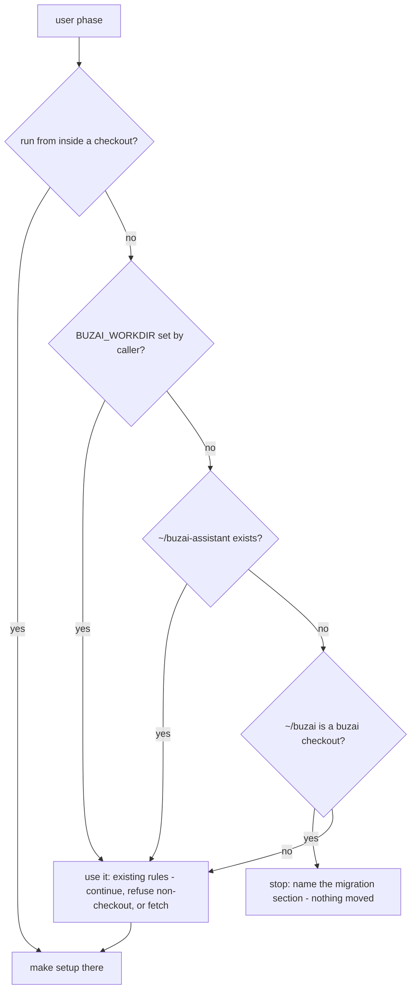

# Deployment Directory Name - Plan

## Goal Capsule

- **Objective:** On a host that runs both a deployed buzai assistant and a dev checkout, the Remote Control environment picker shows two different names, so the owner cannot send a prompt to the wrong instance by mistake.
- **Means:** new installs land in `~/buzai-assistant`, existing installs move there by a documented procedure, and dev checkouts keep their natural repo-name path (KTD1, KTD2).
- **Authority:** issue #17 and the operator's sign-off comment on it (the name `~/buzai-assistant` is decided). The operator signs off on this plan before any build. Then this plan, then repo conventions (`CLAUDE.md`).
- **Stop conditions:** stop and comment on #17 if the build would touch a real deployment or `~/.config/systemd`, edit `scripts/publish_gate.py`, or need a decision this plan does not settle.
- **Execution profile:** one pull request, built after #5 and #20 merge and merged before #19. The worker builds it and the operator merges it.

---

## Product Contract

### Summary

The default deployment directory becomes `~/buzai-assistant`. The installer clones there, and `make service-install` points the unit at whichever checkout it runs from. An existing install at `~/buzai` keeps working untouched until its owner follows a short migration section. A re-run of the installer that finds an old `~/buzai`, with `BUZAI_WORKDIR` unset and no `~/buzai-assistant`, stops and points at that section rather than making a second clone. No new configuration variable is added. The docs explain why the picker label depends on the directory name.

### Problem Frame

Claude Code labels each Remote Control environment in the picker by working-directory basename plus hostname. `--name` names sessions, not the environment. A deployed assistant at `~/buzai` and a contributor's dev checkout named `buzai` both show up as `buzai · <host>`. The only visible difference is the session capacity. Outside users will install from v0.1.0 on, so the layout has to settle before they do. Moving it later would mean migrating every install.

### Requirements

**Install layout**

- R1. A fresh install puts the deployment checkout at `~/buzai-assistant`, unless the owner sets `BUZAI_WORKDIR`.
- R2. The installed unit's `WorkingDirectory` and every checkout path in it name the checkout `make service-install` ran from. `WORKDIR=` still overrides it.
- R3. Dev checkouts are not renamed or relocated by anything in this change.

**Existing installs**

- R4. An existing install at `~/buzai` keeps running after `git pull`, with no change to its installed unit, until its owner migrates.
- R5. Re-running the installer on a host that has a `~/buzai` checkout and no `~/buzai-assistant` (with `BUZAI_WORKDIR` unset) stops before cloning. The message names the migration section.
- R6. `make setup` refuses to report the service step done when the installed unit points at a different checkout from the one setup is running in. The message names the fix.
- R7. A documented migration procedure moves an existing install to `~/buzai-assistant` and ends with the service live. It covers the venv rebuild, the reinstalled unit, and the per-path Claude Code state.

**Explanation**

- R8. The docs explain that the picker label comes from the directory name, and why the deployment and dev checkouts must not share a basename.
- R9. `make service-install` prints a note when the checkout's basename is `buzai`, naming the picker collision and the migration section. It still installs.

### Key Decisions

- **No new override variable (no `BUZAI_HOME`).** The two existing knobs already cover both moments the path is chosen: `BUZAI_WORKDIR` when the installer clones and `WORKDIR=` when the unit is installed. A third name for the same path would be one more thing that can disagree. Governs R1, R2.
- **The unit follows the checkout, not a hard-coded default.** If the Makefile defaulted `WORKDIR` to `~/buzai-assistant`, an old install that re-ran `make service-install` after `git pull` would get a unit pointing at a directory that does not exist. Governs R2, R4.
- **Migration is documented, not scripted.** It runs once on very few installs, mostly the operator's own. A script that moves a live deployment is riskier than the steps it replaces, and this ticket may not exercise it against a real deployment. Governs R7.
- **No symlink alternative is documented.** See KTD4. Governs R7, R8.

### Scope Boundaries

- The service account name (`buzai`), `~/.config/buzai/`, `~/hubs`, the unit name `claude-remote`, and `--name buzai-assistant` do not change.
- Dated history (`docs/plans/`, `docs/decisions/`, `docs/brainstorms/`, `docs/ideation/`) is not rewritten. It records what was true when written.
- `scripts/publish_gate.py` is not edited; #19 retires it.
- No change touches a real deployment. The operator migrates their own install from the merged docs.

#### Deferred to Follow-Up Work

- `CONTRIBUTING.md` gets a one-line pointer to the convention ("don't name a dev checkout `buzai-assistant`"). This lands in this PR if #12 has merged by build time, and in a follow-up otherwise, to avoid a conflict with #12.

---

## Planning Contract

### Key Technical Decisions

- KTD1. **`WORKDIR` defaults to `$(CURDIR)` in the Makefile.** The template's checkout token becomes `%h/buzai-assistant`, and `service-install` substitutes it whenever `WORKDIR` differs from `$(HOME)/buzai-assistant`. This instantiates "the unit follows the checkout" (R2, R4). The old sed pattern `%h/buzai` is a prefix of the new token, so the substitution must match the whole token `%h/buzai-assistant`. Otherwise a non-default `WORKDIR` gets a stray `-assistant` suffix.
- KTD2. **The installer's default moves; detection of the old layout is narrow.** `BUZAI_WORKDIR` defaults to `$HOME/buzai-assistant`. The legacy stop (R5) fires only when all three hold: `BUZAI_WORKDIR` was not set by the caller, `~/buzai` is a buzai checkout (same `Makefile` + `trust/` test the user phase already uses), and `~/buzai-assistant` does not exist. It never moves or deletes anything.
- KTD3. **Setup's service probe checks the unit's target, not just its presence.** Step 8 currently passes when the unit file exists. It will also read the installed `WorkingDirectory`, expand a leading `%h` to `$HOME`, and fail with "run `make service-install` from this checkout" when the result differs from `pwd -P`. The expansion is required: a default install, or any legacy unit, carries the unsubstituted `%h/...` value, and a raw string compare would refuse every one of them. `pwd -P` matches make's `$(CURDIR)`, which is the physical path. A silent reinstall could repoint a working service at a checkout the owner did not mean to deploy, so the step refuses rather than rewriting. Covers R6.
- KTD4. **Symlinks are not offered as a no-move alternative.** The installed Claude Code binary (2.1.293) contains no read of `process.env.PWD`. Its working directory therefore comes from `getcwd()`, which the kernel returns with symlinks resolved. A `WorkingDirectory` that is a symlink named `buzai-assistant` would very likely still be labelled `buzai`. Even if the label did change, one checkout reachable under two paths splits Claude Code's per-path state (project consent, transcripts, auto-memory) between them. The optional live spike in Open Questions would confirm the label behaviour. This decision does not depend on its result.
- KTD5. **Living-doc guard test.** One test scans the living docs for instructions that clone into, `cd` into, or name `~/buzai` as the workspace, and fails on any match. The living docs are `README.md`, `CONCEPTS.md`, `docs/*.md`, `deploy/README.md` and `install.sh` comments. Dated history directories are excluded. The pattern must not match `~/buzai-assistant`, `~/.config/buzai`, `/home/buzai` as the account home, or the `buzai` account name. This follows the existing doc-guard pattern in `scripts/tests/test_service_unit.py` (`test_no_doc_still_tells_the_owner_to_answer_the_spawn_prompt`).

### High-Level Technical Design

Installer user phase, workspace resolution (directional, not an implementation):

### Migration procedure (content for R7)

The SETUP.md section walks the owner through these steps, run as the service account:

1. `make service-stop`.
2. `mv ~/buzai ~/buzai-assistant && cd ~/buzai-assistant`.
3. `rm -rf .venv && make venv`. The venv embeds absolute paths.
4. Move Claude Code's per-path project directory, `~/.claude/projects/-home-<account>-buzai`, to `-buzai-assistant`. This keeps transcripts and auto-memory. It is optional, and the doc says what is lost if it is skipped.
5. Run `claude` once in `~/buzai-assistant`, answer "Yes, I trust this folder", and exit. Folder trust is recorded per path, so the moved checkout starts untrusted, and `claude remote-control` refuses an untrusted workspace ("Workspace not trusted. Run `claude` in …") rather than asking. Run `make prime-consent` only if setup reports the consent missing.
6. `make service-install`, then `make service-start`, `make liveness`, `make doctor`.
7. Confirm the picker now shows `buzai-assistant · <host>`.

Hubs (`~/hubs`), secrets (`~/.config/buzai/secrets/`) and `.claude/settings.json` are unaffected. The hooks resolve through `$CLAUDE_PROJECT_DIR` and `trust/bin/gate` resolves its own directory. `audit/` moves with the checkout. Rollback is the same steps in reverse.

### Assumptions

- Folder trust is stored per absolute path in `~/.claude.json` and is granted by an interactive `claude` run, as SETUP.md §3 describes for a fresh install. The Remote Control consent (`remoteDialogSeen`) is account-wide, as `install.sh` already probes it, so a move does not normally need it re-primed.
- Claude Code names its per-project directory by replacing `/` and `.` in the absolute path with `-`. This matches the directories observed on this host.

### Sequencing

#5 and #20 merge first. Rebase on main, then U1 → U2 → U3. U4 is independent and lands only if the operator opts in. One PR, "Closes #17".

---

## Implementation Units

### U1. Unit template and `make service-install`

- **Goal:** the installed unit points at the checkout it was installed from, and the template documents `~/buzai-assistant` (R2, R4, R9; KTD1).
- **Files:** `deploy/claude-remote.service.template`, `Makefile`, `scripts/tests/test_service_unit.py`.
- **Approach:** replace every `%h/buzai` checkout path in the template with `%h/buzai-assistant` (`WorkingDirectory`, both `ExecStartPre`, the `ExecStartPost` pair). Set `WORKDIR ?= $(CURDIR)` and match the full token in the sed. Add the R9 note. Update the `service-install` help text and the template header comment. Update the two existing tests that pin `%h/buzai/` and `/buzai/.venv/bin/python`.
- **Test scenarios** (new class in `scripts/tests/test_service_unit.py`; runs the real recipe with `HOME` set to a scratch directory and a stub `systemctl` in `<scratch>/.local/bin`, which the Makefile's own `PATH` export puts first):
  - Run from a checkout at `<scratch>/buzai-assistant`: every checkout path in the unit is that directory and no `%h/buzai` remains.
  - `WORKDIR=<scratch>/elsewhere`: every path is `<scratch>/elsewhere`, with no `-assistant` left over. This is the KTD1 prefix trap, and the test is shown failing against a prefix-matching sed first.
  - Checkout basename `buzai`: the unit installs, and output carries the note that names the picker collision and the migration section.
  - Basename `buzai-assistant`: no note.
  - The stub records `daemon-reload`, and nothing is written outside the scratch `HOME`.
- **Verification:** new tests fail on origin/main, then pass, and the reasons are recorded in the PR body.

### U2. Installer default, legacy stop, and setup's unit-target probe

- **Goal:** fresh installs clone into `~/buzai-assistant`, an old layout is never silently duplicated, and setup notices a unit aimed at another checkout (R1, R5, R6; KTD2, KTD3).
- **Files:** `install.sh`, `scripts/tests/test_host_bootstrap.py`.
- **Approach:** change the `BUZAI_WORKDIR` default, its usage comment, and the printed manual-clone line. Remember whether the caller set `BUZAI_WORKDIR` before the default is applied. Add the legacy stop per the flowchart. Put the step 8 comparison (KTD3) in a named helper next to `consent_recorded`, and call it from step 8. Update the "run from the repo root" message. The script's entry point is not changed.
- **Test scenarios:**
  - Legacy stop: scratch `HOME` with a fake `~/buzai` checkout (`Makefile` + `trust/`), no `~/buzai-assistant`, `BUZAI_WORKDIR` unset. The user phase exits non-zero, the message names the migration section, and no clone is attempted. The stub `git` records no call.
  - The same layout with `BUZAI_WORKDIR=<scratch>/buzai` set: no stop, and it continues there.
  - `~/buzai-assistant` already a checkout alongside a legacy `~/buzai`: no stop, and it continues in `~/buzai-assistant`.
  - Fresh scratch `HOME`: the clone target is `<scratch>/buzai-assistant`.
  - Step 8 helper: a unit whose `WorkingDirectory` names another checkout fails with a message naming `make service-install`.
  - Step 8 helper: an unsubstituted `WorkingDirectory=%h/buzai-assistant` passes when the checkout is `<scratch HOME>/buzai-assistant`, and a legacy `%h/buzai` unit passes from `<scratch HOME>/buzai` (R4). Both are shown failing first against a raw string compare.
  - Each refusal is asserted by its message, not just its exit code.
- **Execution note:** the user-phase scenarios run `install.sh` with `BUZAI_ALLOW_ADMIN_INSTALL=1` (the existing opt-out, so the admin guard stays intact), from a scratch cwd that is not a checkout, with stub `git` and `make` first on `PATH`. Step 8 sits behind steps 1–7, which need real credentials, so the helper is tested on its own. The test extracts the helper's definition from the `install.sh` text and runs it under `bash -c` with a scratch `HOME` and a planted unit file. Sourcing `install.sh` would run its entry `case`, so the test does not source it.
- **Verification:** new tests fail on origin/main, then pass.

### U3. Docs, migration section, and the living-doc guard

- **Goal:** every living doc names `~/buzai-assistant`, explains the picker label, and carries the migration procedure (R3, R7, R8; KTD4, KTD5).
- **Files:** `docs/SETUP.md` (workspace path, `service-install` line, `/home/buzai/buzai` pull example, new "Moving an existing install" section), `docs/QUICKSTART.md`, `docs/HOST-BOOTSTRAP.md`, `docs/TROUBLESHOOTING.md`, `docs/TRY-IT.md`, `deploy/README.md`, `CONCEPTS.md` (a "Deployment directory" entry under Remote Control: picker label = basename + host), `README.md` (one sentence pointing at it, if the install section names the path), `trust/tests/test_gate.py` (fixture path `/home/buzai/buzai/...` → `/home/buzai/buzai-assistant/...`, for consistency only), and a new test, `scripts/tests/test_layout_docs.py`.
- **Approach:** edit the path references found by the audit in each file. The migration section carries the procedure from the Planning Contract and states the symlink answer in one sentence (KTD4). `CLAUDE.md` names no checkout path, so it is not edited.
- **Test scenarios** (`scripts/tests/test_layout_docs.py`):
  - On origin/main the guard fails and lists the offending lines (SETUP.md, QUICKSTART.md, and others).
  - After the edits it passes.
  - Planted lines prove the pattern's edges. `~/.config/buzai/secrets`, `ssh buzai@host`, `/home/buzai/.ssh` and `~/buzai-assistant` do not match. `cd ~/buzai` and `git clone … ~/buzai` do.
  - `SETUP.md` contains the migration section, and it mentions the venv rebuild and `make service-install`.
- **Verification:** `make test` is green, and the failing-first run is in the PR body.

### U4. (Optional — operator decides at sign-off) Retire stale start-limit wording left by #5

- **Goal:** once #5 removes `StartLimitBurst=5`, no living doc or code comment still justifies a design by that setting.
- **Files:** `deploy/README.md`, `docs/TROUBLESHOOTING.md`, `docs/solutions/architecture-patterns/start-time-gate-severity-split-2026-09-18.md`, `docs/solutions/best-practices/preflight-checks-content-not-just-permissions-2026-09-18.md`, and the docstrings and comments in `scripts/secrets_preflight.py`, `scripts/hub_init.py`, `scripts/hub_commit.py`, `scripts/tests/test_secrets_preflight.py`, `scripts/tests/test_hub_init.py`, `scripts/tests/test_hub_commit.py`. `docs/decisions/` and `docs/plans/` stay as history.
- **Approach:** reword against #5's merged template and its `docs/solutions` entry. The reason the WARN/FAIL split exists still stands: a durability problem must not take the assistant off the air. Only the "five restarts and it is gone" mechanism goes. Comments and prose only, with no behaviour change. If buzai-deploy's follow-up issue is filed, reference it as "Part of".
- **Test expectation:** none — wording only. `make test` must stay green. If a test asserts the old wording, update the assertion in the same commit and say so in the PR body.

---

## Verification Contract

| Gate | Command | Applies to |
|---|---|---|
| Unit tests | `make test` (stdlib unittest, `.venv` Python) | all units |
| Hygiene, ruff, secret scan | `pre-commit run --all-files` | all units |
| Failing-first | each new test run against origin/main code, with output and reason captured in the PR body | U1, U2, U3 |
| CI | read the conclusions on the pushed head until green | PR |

The tool versions used locally (Python, ruff, pre-commit) are named in the PR body. No test writes outside a scratch `HOME`, and none touches `~/.config/systemd` or a real install.

## Definition of Done

- R1–R9 hold. Each one is covered by a U1–U3 test or by the migration section.
- The new tests were each seen to fail first, and the refusals are asserted by their reason.
- The PR body opens with At a glance (Problem, Spec drift, Solution) and records every review finding's disposition. Related reads `Closes #17`, and `closingIssuesReferences` is checked to return only `[17]`.
- U4 is present only if the operator opted in at sign-off.
- No abandoned-attempt code or scratch files remain in the diff.

---

## Open Questions

- **Live symlink spike (optional, deferred to the operator).** Confirming KTD4 empirically means registering a throwaway Remote Control environment on the operator's account and reading the picker. That is outward-facing and needs a human looking at the picker. Recommendation: skip it, because KTD4 stands either way. If the operator wants it, they run it, or approve the worker running it from a scratch directory, and the result goes into the migration section's symlink sentence.
